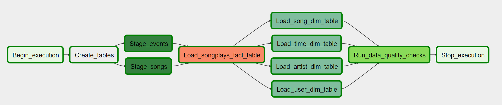

# Data-Pipeline-with-Apache-Airflow

## Motivation
This project is to demonstrate how to apply Apache Airflow, a well-known workflow management platform on data warehousing. In this project, we will transfer Sparkify application data from Amazon S3 storage to Amazon Redshift data warehouse.

## Introduction
There are two main source of data in this project. The first one is song_data that containing all the information of available songs within Sparkify system. The other is log data that preserves all user activities. 

We will be using Apache Airflow dags to contro and monitor all tasks required for this project. We will build task creating tables with desired schema and then stage the dataset from S3 to Redshift. Finally, we will run insert command to build fact and dimension tables from staging tables. In the last part of the dag, we will be checking data quality by calling some results from Redshift connection.

## Airflow Settings
1. Configuration settings

2. Configure settings for AWS credentials: 
- The login is your AWS access key id
- The passwork is your AWS secret access key

3. Configue connection settings for Redshift
- You can get the host in AWS Redshift cluster property
- The login is your database user configured for the Redshift database
- The password is the password for the user mentioned above

## Data Workflow
Below is the final graph view of dag in this project

- Begin_execution: DummyOperator, indicating start of the dag
- Create_tables: PostgresOperator, creating tables in Redshift
- Stage_events: StageToRedshiftOperator, staging event logs data from S3 to Redshift
- Stage_songs: StageToRedshiftOperator, staging songs data from S3 to Redshift
- Load_songplays_fact_table: LoadFactOperator, running insertion to songplays fact table
- Load_song_dim_table: LoadDimensionOperator, running insertion to songs dimension table
- Load_time_dim_table: LoadDimensionOperator, running insertion to time dimension table
- Load_artist_dim_table: LoadDimensionOperator, running insertion to artists dimension table
- Load_user_dim_table: LoadDimensionOperator, running insertion to users dimension table
- Run_data_quality_checks: DataQualityOperator, running data quality on fact and dimension tables in Redshift
- Stop_execution: DummyOperator, indicating end of the dag

## Schema of Tables

Below is the diagram of schemas and structure of this project  

### Staging Tables

- **Staging_Events: Records of all activities**  
*event_id,artist,auth,firstName text, gender text, itemInSession int, lastName text, length float, level text, location text, method, page, registration, sessionId, song, status, ts, userAgent, userId*

- **Staging_Songs: Records of all songs** 
*num_songs, artist_id, artist_latitude, artist_longitude, artist_location, artist_name, song_id, title, duration, year*

### Redshift Tables 

- **songplays (fact table): Records in event data associated with song plays**  
*songplay_id, start_time, user_id, level, song_id, artist_id, session_id, location, user_agent*

- **users (dimension table): Users in the app**  
*user_id, first_name, last_name, gender, level*

- **songs (dimension table): Songs in music database**  
*song_id, title, artist_id, year, duration*

- **artists (dimension table): Artists in music database**  
*artist_id, name, location, lattitude, longitude*

- **time (dimension table): Timestamps of records in songplays broken down into specific units**  
*start_time, hour, day, week, month, year, weekday*

## Libraries Used 
- datetime: Handling datetime
- airflow

## Files and Folders
- dags
  |- create_tables.sql: Include sql commands required for creating tables in Redshift
  |- s3toRedshift_dwh_dag: Create dag object for the project

- plugins
  |- __init__.py: Configure operators and helpers by creating AirflowPlugin object
  |- helpers
    |- sql_queries.py: Include obejct containing sql queries required for table insertion in Redshift
  |- operators
    |- data_quality.py: Create DataQualityOperator for data quality check
    |- load_dimension.py: Create LoadDimensionOperator class for loading dimension tabel in Redshift
    |- load_fact.py: Create LoadFactOperator class for loading fact table in Redshift
    |- stage_redshift.py :Create StageToRedshiftOperator class for staging tables from S3 to Redshift
  
## Summary
We can successfully transfer Sparkify logs and songs data from S3 to Redshift using Airflow dag. Besides, we also create star schema fact and dimension tables in Redshift. Last but no least, data quality checks and log information in Airflow helps us understand and monitor the pipeline process in a useful way.

## Acknowledgement
Special thanks to Udacity for providing data and technical training required to complete this project
